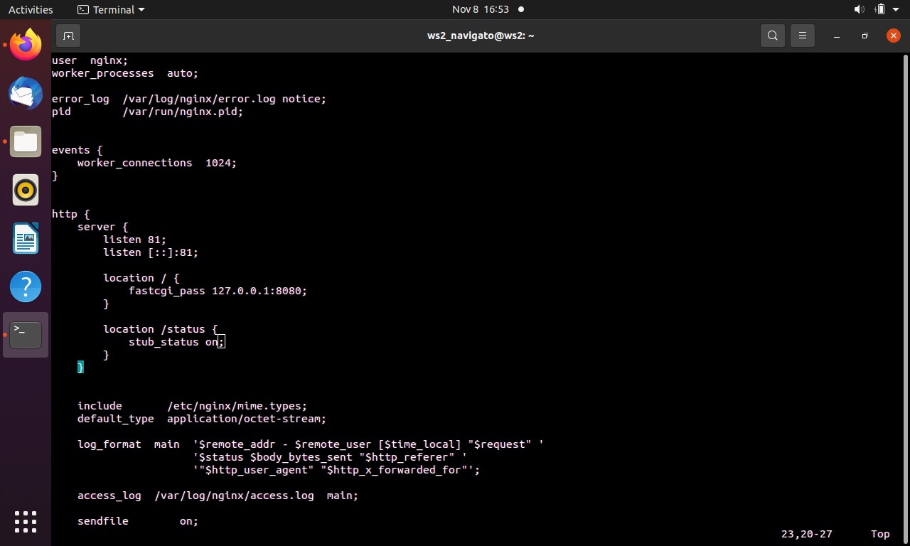

## Part 1. Готовый докер

1.1 Берем официальный докер образ с nginx и качаем его при помощи `docker pull`

1.2 Проверяем наличие докер образа через команду `docker images`

1.3 Запуск докер образа через `docker run -d [image_id|repository]` и проверка, что он запустился `docker ps`

1.4 Просмотр информации о контейнере через `docker inspect [container_id|container_name]`

1.4.1 Размер контейнера

1.4.2 Список замапленных портов

1.4.3 IP контейнера

1.5 Остановка докер образа через `docker stop` и проверка, что он остановился через `docker ps`

1.6 Запуск докера с замапленными портами 80 и 443 на локальную машину через команду `docker run`

1.7 Проверка по адресу localhost:80 доступности стартовой страницы nginx через `curl localhost:80`

1.8 Перезапуск докер контейнера через `docker restart [container_id|container_name]` и проверка, что запущен

## Part 2. Операции с контейнером

2.1 Выводим на экран конфигурационный файл nginx.conf внутри докер контейнера через команду `exec`

2.2 Создаем на машине файл `nginx.conf` с настройкой отдачи страницы со статусом сервера nginx

2.3 Копируем созданный файл `nginx.conf` в докер образ и перезапускаем nginx внутри докер образа

2.4 Проверка по адресу localhost:80 доступности стартовой страницы nginx через `curl localhost:80/status`

2.5 Экспорт контейнера в файл container.tar через команду `export` и остановка контейнера

2.6 Удаление образа через `docker rmi [image_id|repository]`, далее удаление остановленного контейнера

2.7 Импорт контейнера обратно в образ докера

2.7 Запуск контейнера и проверка отдачи страницы со статусом сервера nginx через `curl localhost:80/status`

## Part 3. Мини веб-сервер

3.1 Мини сервер, который возвращает простейшую страничку с надписью Hello World!

3.2 Свой `nginx.conf`, который будет проксировать все запросы с 81 порта на 127.0.0.1:8080

3.3 Качаем docker nginx через команду `sudo docker pull nginx`

3.4 Далее, сверяемся, что образ скачан командой `sudo docker images` установлен корректно

3.5 Производим запуск Docker образа с указанаием порта

3.6 Проверяем, что контейнер запущен командой `sudo docker ps`

3.7 Копируем конфиг и минисервер в контейнер

3.8 Заходим в контейнер и проверяем, что установились скопированные файлы

3.9 Проверяем, что минисервер установлен

3.10 Обновляем систему и устанавливаем утилиты `gcc, spawn-fcgi, libfcgi-dev`

3.11 Компилируем и запускаем наш мини сервер

3.12 Перезагружаем nginx и смотрим привествие мини сервера командой `curl localhost:81`

## Part 4. Свой докер

4.1 Пишем скрипт для запуска мини сервера на порту 8080

4.2 Собираем Dockerfile

4.3 Запускаем Dockerfile командой `sudo docker build -t navigato:new .`

4.4 Окончание сборки Docker образа посредством докерфайла

4.5 Запуск докер образа маппингом папки `./nginx` внутрь контейнера. Проверка доступа страницы `localhost:80`

4.6 Добавим в `./nginx/nginx.conf` проксирование странички `/status`, по которой надо отдавать статус сервера `nginx`

4.7 Смотрим, что образ запущен корректно

4.8 Перезапускаем докер командой `sudo docker restart pontorez`

4.9 Фиксируем удачную отдачу странички командной `curl localhost:80/status`

## Part 5. Dockle

5.1 Сканируем образ и смотрим на ошибки (fatal) и предупреждения (warning)

5.2 Вносим правки в Dockerfile

5.3 Запускаем снова docker build Для сборки образа

5.4 Исправленный образ без ошибок и предупреждений

## Part 6. Базовый Docker Compose

6.1 Собираем `docker-compose.yml`, в нем поднимаем 2 контейнера и мапим 8080 порт 2-го контейнера на 80 порт локальной машины

6.2 Собираем и запускаем проект с помощью команд `docker-compose build` и `docker-compose up`

6.3 Фиксируем, что в браузере по `localhost:80` отдается написанная страничка, как и ранее
